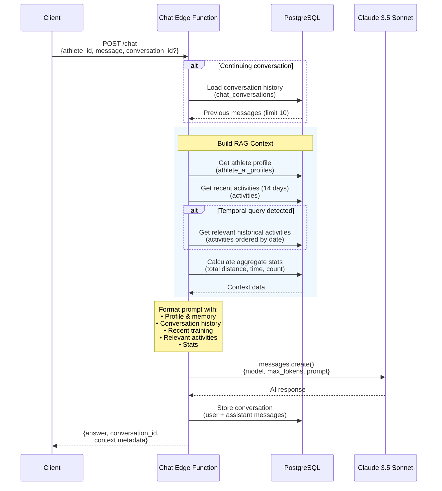

# Runaway Edge Functions

Backend services for **Runaway** — an AI-powered running coach that connects to your Strava account to provide personalized coaching, training insights, and weekly journals.

## What is Runaway?

Runaway is a mobile app that turns your Strava data into actionable coaching. It syncs your activities, analyzes your training patterns, and provides an AI coach you can chat with about your running.

**Core Features:**
- **AI Coach** — Chat with a coach who knows your complete training history
- **Weekly Journals** — Automated summaries with insights about your training
- **Strava Sync** — Automatic activity import with full data preservation

## Project Structure

```
runaway-edge/
├── functions/
│   ├── _shared/                  # Shared utilities
│   ├── chat/                     # AI coaching conversations
│   ├── journal/                  # Weekly training summaries
│   ├── oauth-callback/           # Strava authorization
│   ├── sync-beta/                # Activity sync job creation
│   └── sync-processor/           # Background activity fetching
│
├── supabase/
│   └── migrations/               # Database schema
│
└── DEPLOYMENT_GUIDE.md           # Deployment instructions
```

## Edge Functions

### Chat (`/functions/v1/chat`)

AI coaching powered by Claude 3.5 Sonnet with RAG over your activity history.

**How it works:**
- Retrieves your athlete profile and training preferences
- Loads recent activities (last 14 days) for context
- Searches historical activities for relevant data
- Maintains conversation memory across sessions



### Journal (`/functions/v1/journal`)

Generates AI-powered weekly training summaries with statistics, comparisons, and personalized insights.

**Includes:**
- Weekly stats (distance, pace, elevation, heart rate)
- Week-over-week trend analysis
- AI-generated narrative and recommendations
- Categorized insights (achievements, patterns, areas to improve)

### OAuth Callback (`/functions/v1/oauth-callback`)

Handles the Strava OAuth flow when users connect their account.

### Sync Beta (`/functions/v1/sync-beta`)

Creates background jobs to fetch activities from Strava. Called from the iOS app when users request a sync.

### Sync Processor (`/functions/v1/sync-processor`)

Background worker that processes sync jobs:
- Fetches activities from Strava API with pagination
- Handles token refresh automatically
- Rate limits requests to respect Strava limits
- Retries failed requests

**Runs automatically** via pg_cron every 5 minutes.

## Database

### Core Tables

| Table | Purpose |
|-------|---------|
| `activities` | Strava activity data (distance, pace, HR, maps, etc.) |
| `strava_tokens` | OAuth tokens with auto-refresh |
| `sync_jobs` | Background job queue with progress tracking |
| `chat_conversations` | Conversation history for AI coach |
| `athlete_ai_profiles` | Athlete preferences and coaching memory |

### Scheduled Jobs (pg_cron)

- **Every 5 min** — Process pending sync jobs
- **Every 10 min** — Reset stuck jobs
- **Daily 2 AM** — Clean up old completed jobs

## Tech Stack

- **Runtime**: Deno + Supabase Edge Functions
- **Database**: PostgreSQL 17
- **AI**: Anthropic Claude 3.5 Sonnet
- **External API**: Strava API v3
- **Scheduling**: pg_cron

## Deployment

See **[DEPLOYMENT_GUIDE.md](./DEPLOYMENT_GUIDE.md)** for complete instructions.

```bash
# Link project
supabase link --project-ref your-ref

# Run migrations
supabase db push

# Set secrets
supabase secrets set ANTHROPIC_API_KEY=xxx
supabase secrets set STRAVA_CLIENT_ID=xxx
supabase secrets set STRAVA_CLIENT_SECRET=xxx

# Deploy all functions
supabase functions deploy chat
supabase functions deploy journal
supabase functions deploy oauth-callback
supabase functions deploy sync-beta
supabase functions deploy sync-processor
```

## Local Development

```bash
# Start local Supabase
supabase start

# Serve a function
supabase functions serve chat --env-file .env.local

# Test
curl -X POST http://localhost:54321/functions/v1/chat \
  -H "Content-Type: application/json" \
  -d '{"athlete_id": 123, "message": "How was my week?"}'
```

## Security

- OAuth tokens stored encrypted in Supabase
- Automatic token refresh before expiration
- Row Level Security (RLS) on all tables
- Secrets managed via Supabase environment variables

## License

Proprietary - Runaway App © 2025
