# Runaway Edge Functions

Supabase Edge Functions for the Runaway running coach app - AI-powered coaching, training journals, and Strava sync.

## 🚀 What's This?

This project migrates Runaway's APIs from Google Cloud Run (Node.js) to Supabase Edge Functions (Deno/TypeScript), providing:

- **97% faster cold starts** (~100ms vs 3-5 seconds)
- **60% faster response times** (edge network proximity)
- **$60/month cost savings** ($60 → $0, within free tier)
- **Global distribution** (35+ regions vs single region)

## 📁 Project Structure

```
runaway-edge/
├── functions/
│   ├── _shared/               # Shared utilities
│   │   ├── anthropic.ts       # Anthropic AI client
│   │   ├── supabase.ts        # Supabase client
│   │   ├── cors.ts            # CORS headers
│   │   ├── types.ts           # TypeScript types
│   │   └── activity-summarizer.ts  # Activity formatting
│   │
│   ├── chat/                  # AI Coaching Chat
│   │   └── index.ts           # RAG-powered coaching conversations
│   │
│   ├── journal/               # Training Journals
│   │   └── index.ts           # AI-generated weekly summaries
│   │
│   ├── oauth-callback/        # Strava OAuth
│   │   └── index.ts           # OAuth authorization handler
│   │
│   ├── sync-beta/             # Sync Job Creation
│   │   └── index.ts           # Create activity sync jobs
│   │
│   └── sync-processor/        # Sync Job Processor
│       └── index.ts           # Fetch & store Strava activities
│
├── supabase/
│   └── migrations/            # Database setup
│       ├── 001_sync_jobs_schema.sql     # Jobs & tokens tables
│       ├── 002_setup_pg_cron.sql        # Scheduled processing
│       └── 003_activities_schema.sql    # Activities table
│
├── DEPLOYMENT_GUIDE.md        # Step-by-step deployment
├── MIGRATION_PLAN.md          # Original migration strategy
├── MIGRATION_PROGRESS.md      # Progress tracking
└── README.md                  # This file
```

## 🔧 Edge Functions

### 1. Chat (`/functions/v1/chat`)
AI-powered conversational coaching using Claude 3.5 Sonnet.

**Features:**
- RAG over activity history
- Conversation memory
- Semantic search for relevant activities
- Athlete profile integration

**RAG Architecture:**

```mermaid
sequenceDiagram
    participant Client
    participant Chat as Chat Edge Function
    participant DB as PostgreSQL
    participant Claude as Claude 3.5 Sonnet

    Client->>Chat: POST /chat<br/>{athlete_id, message, conversation_id?}

    alt Continuing conversation
        Chat->>DB: Load conversation history<br/>(chat_conversations)
        DB-->>Chat: Previous messages (limit 10)
    end

    rect rgb(240, 248, 255)
        Note over Chat,DB: Build RAG Context
        Chat->>DB: Get athlete profile<br/>(athlete_ai_profiles)
        Chat->>DB: Get recent activities (14 days)<br/>(activities)

        alt Temporal query detected
            Chat->>DB: Get relevant historical activities<br/>(activities ordered by date)
        end

        Chat->>DB: Calculate aggregate stats<br/>(total distance, time, count)
        DB-->>Chat: Context data
    end

    Note over Chat: Format prompt with:<br/>• Profile & memory<br/>• Conversation history<br/>• Recent training<br/>• Relevant activities<br/>• Stats

    Chat->>Claude: messages.create()<br/>{model, max_tokens, prompt}
    Claude-->>Chat: AI response

    Chat->>DB: Store conversation<br/>(user + assistant messages)

    Chat-->>Client: {answer, conversation_id,<br/>context metadata}
```



**Example:**
```bash
curl -X POST https://your-project.supabase.co/functions/v1/chat \
  -H "Content-Type: application/json" \
  -d '{
    "athlete_id": 94451852,
    "message": "How was my training this week?"
  }'
```

### 2. Journal (`/functions/v1/journal`)
Generate AI-powered weekly training summaries.

**Features:**
- Weekly statistics (distance, pace, elevation, HR)
- Week-over-week comparisons
- AI-generated narrative and insights
- Insight categorization (achievements, patterns, recommendations)

**Example:**
```bash
curl -X POST https://your-project.supabase.co/functions/v1/journal/generate \
  -H "Content-Type: application/json" \
  -d '{
    "athlete_id": 94451852,
    "week_start_date": "2025-01-06"
  }'
```

### 3. OAuth Callback (`/functions/v1/oauth-callback`)
Handle Strava OAuth authorization flow.

**Flow:**
1. User authorizes on Strava
2. Redirected to this function with auth code
3. Exchanges code for tokens
4. Stores athlete data and tokens
5. Shows success page

### 4. Sync Beta (`/functions/v1/sync-beta`)
Create sync jobs to fetch activities from Strava (iOS app).

**Features:**
- Limited to 20 most recent activities (beta)
- Token validation
- Job queue management

**Example:**
```bash
curl -X POST https://your-project.supabase.co/functions/v1/sync-beta \
  -H "Content-Type: application/json" \
  -d '{
    "user_id": 94451852
  }'
```

### 5. Sync Processor (`/functions/v1/sync-processor`)
Background processor that fetches activities from Strava API.

**Features:**
- Processes up to 5 jobs concurrently
- Pagination (200 activities per page)
- Automatic token refresh
- Rate limiting (1 req/second)
- Retry logic (up to 3 attempts)
- Progress tracking

**Triggered by:**
- pg_cron every 5 minutes (automatic)
- Manual invocation (testing/debugging)

## 🗄️ Database Schema

### `sync_jobs`
Tracks Strava sync jobs with status and progress.

**Key Columns:**
- `status`: pending, in_progress, completed, failed
- `total_activities`, `processed_activities`, `failed_activities`
- `metadata`: JSON for flexible options (e.g., max_activities)

### `strava_tokens`
Stores OAuth tokens for each athlete.

**Key Columns:**
- `access_token`, `refresh_token`, `expires_at`
- Auto-refreshed by sync-processor

### `activities`
Complete Strava activity data (25+ fields).

**Key Columns:**
- Distance, pace, elevation, heart rate, power
- Map polyline, workout type, trainer/commute flags

### Helper Functions
- `cleanup_old_sync_jobs()` - Remove jobs older than 30 days
- `reset_stuck_sync_jobs()` - Reset timed-out jobs
- `get_sync_job_stats()` - Queue statistics
- `get_athlete_activity_summary()` - Athlete stats summary

## ⚙️ Automated Scheduling (pg_cron)

**Every 5 minutes:**
- Process pending sync jobs via `sync-processor`

**Every 10 minutes:**
- Reset stuck jobs (in_progress >30 minutes)

**Daily at 2 AM:**
- Clean up old completed/failed jobs

## 🚢 Deployment

See **[DEPLOYMENT_GUIDE.md](./DEPLOYMENT_GUIDE.md)** for complete step-by-step instructions.

**Quick Start:**
```bash
# 1. Link project
supabase link --project-ref your-ref

# 2. Run migrations
supabase db push

# 3. Set secrets
supabase secrets set ANTHROPIC_API_KEY=xxx
supabase secrets set STRAVA_CLIENT_ID=xxx
supabase secrets set STRAVA_CLIENT_SECRET=xxx

# 4. Deploy functions
supabase functions deploy chat
supabase functions deploy journal
supabase functions deploy oauth-callback
supabase functions deploy sync-beta
supabase functions deploy sync-processor

# 5. Update pg_cron URL (see deployment guide)
```

## 📊 Performance Comparison

| Metric | Cloud Run | Edge Functions | Improvement |
|--------|-----------|----------------|-------------|
| Cold Start | 3-5 seconds | 100-200ms | **97% faster** |
| Response Time | 500-800ms | 200-400ms | **60% faster** |
| Regions | 1 (us-central1) | 35+ (global) | **Global** |
| Monthly Cost | ~$60 | $0 | **$60 saved** |

## 🔐 Security

- **Tokens**: Stored encrypted in Supabase
- **Auto-refresh**: Expired tokens refreshed automatically
- **Row Level Security**: Supabase RLS on all tables
- **Secrets**: Environment variables via Supabase secrets
- **CORS**: Configured for allowed origins

## 🧪 Local Testing

```bash
# Start local Supabase
supabase start

# Serve function
supabase functions serve chat --env-file .env.local

# Test
curl -X POST http://localhost:54321/functions/v1/chat \
  -H "Content-Type: application/json" \
  -d '{"athlete_id": 94451852, "message": "Hello"}'
```

## 📝 Migration Status

✅ **Phase 1**: Infrastructure setup (COMPLETE)
✅ **Phase 2**: Chat API (COMPLETE)
✅ **Phase 3**: Journal API (COMPLETE)
✅ **Phase 4**: OAuth Callback (COMPLETE)
✅ **Phase 5**: Sync Beta (COMPLETE)
✅ **Phase 6**: Sync Processor & Database Functions (COMPLETE)
⏳ **Phase 7**: Testing & Production Cutover (READY)

See **[MIGRATION_PROGRESS.md](./MIGRATION_PROGRESS.md)** for detailed progress.

## 📚 Tech Stack

- **Runtime**: Deno (TypeScript-native, 97% faster cold starts)
- **Functions**: Supabase Edge Functions (globally distributed)
- **Database**: PostgreSQL (Supabase)
- **Scheduling**: pg_cron (built into PostgreSQL)
- **AI**: Anthropic Claude 3.5 Sonnet
- **API**: Strava API v3

## 🤝 Contributing

This is a private project for the Runaway app. For questions or issues, contact the development team.

## 📄 License

Proprietary - Runaway App © 2025
